# Table of contents

* [About Bowfolios](#about-bowfolios)
* [Installation](#installation)
* [Application design](#application-design)
  * [Directory structure](#directory-structure)
  * [Import conventions](#import-conventions)
  * [Naming conventions](#naming-conventions)
  * [Data model](#data-model)
  * [CSS](#css)
  * [Routing](#routing)
  * [Authentication](#authentication)
  * [Authorization](#authorization)
  * [Configuration](#configuration)
  * [Quality Assurance](#quality-assurance)
* [Development history](#development-history)
  * [Milestone 1: Mockup development](#milestone-1-mockup-development)
  * [Milestone 2: Data model development](#milestone-2-data-model-development)
  * [Milestone 3: Connect UI to data model](#milestone-3-connect-ui-to-data-model)
  * [Milestone 4: Authentication](#milestone-4-authentication)
  * [Milestone 5: Administration](#milestone-5-administration)

# About BowFolios 

BowFolios is a Meteor application providing portfolios for the University of Hawaii community. When you come to the site, you are greeted by the following landing page:

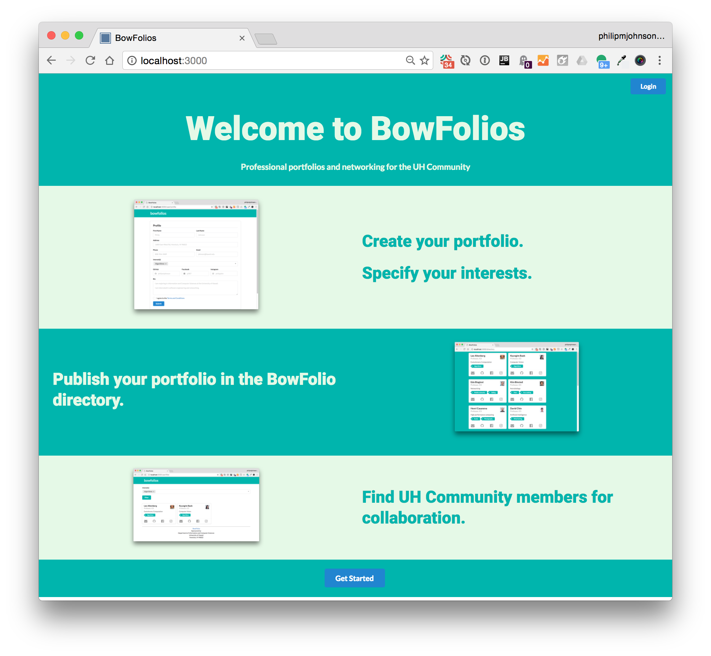

Anyone with a UH account can login to BowFolios and create a profile that provides a biographical statement and list of interests, plus links to selected social media sites (GitHub, FaceBook, Instagram):


  
After creating a profile, the user will be listed on the public directory page:


BowFolios also provides a filter page, available to those who can login to the system with their UH account. The filter page allows you to display all portfolios with a given interest:

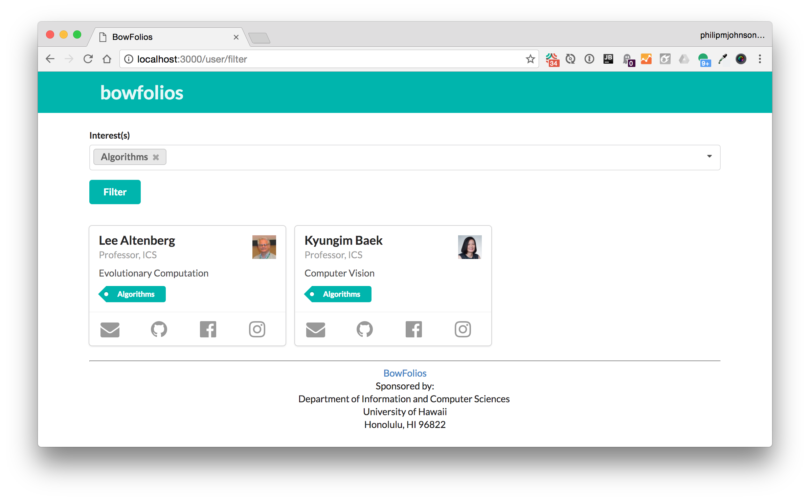

# Installation

First, [install Meteor](https://www.meteor.com/install).

Second, [download a copy of BowFolios](https://github.com/ics-software-engineering/meteor-application-template/archive/master.zip), or clone it using git.
  
Third, cd into the app/ directory and install libraries with:

```
$ meteor npm install
```

Fourth, run the system with:

```
$ meteor npm run start
```

If all goes well, the application will appear at [http://localhost:3000](http://localhost:3000). If you have an account on the UH test CAS server, you can login.  

# Application Design

## Directory structure

The top-level directory structure is:

```
app/        # holds the Meteor application sources
config/     # holds configuration files, such as settings.development.json
doc/        # holds developer documentation, user guides, etc.
.gitignore  # don't commit IntelliJ project files, node_modules, and settings.production.json
```

This structure separates documentation files (such as screenshots) and configuration files (such as the settings files) from the actual Meteor application.

The app/ directory has this structure:

```
client/
  lib/           # holds Semantic-UI files.
  head.html      # the <head>
  main.js        # import all the client-side html and js files. 

imports/
  api/           # Define collection processing code (client + server side)
  startup/       # Define code to run when system starts up (client-only, server-only, both)
    both/          
    client/        
    server/        
  ui/
    layouts/     # Layouts contain common elements to all pages (i.e. menubar and footer)
    pages/       # Pages are navigated to by FlowRouter routes.
    stylesheets/ # CSS customizations, if any.

node_modules/    # managed by Meteor

public/          # static assets (like images) can go here.
  
server/
   main.js       # import all the server-side js files.
```

## Import conventions

This system adheres to the Meteor 1.4 guideline of putting all application code in the imports/ directory, and using client/main.js and server/main.js to import the code appropriate for the client and server in an appropriate order.

This system accomplishes client and server-side importing in a different manner than most Meteor sample applications. In this system, every imports/ subdirectory containing any Javascript or HTML files has a top-level index.js file that is responsible for importing all files in its associated directory.   

Then, client/main.js and server/main.js are responsible for importing all the directories containing code they need. For example, here is the contents of client/main.js:

```
import '/imports/startup/client';
import '/imports/startup/both';
import '/imports/api/stuff';
import '/imports/ui/layouts';
import '/imports/ui/pages';
import '/imports/ui/stylesheets/style.css';
```

Apart from the last line that imports style.css directly, the other lines all invoke the index.js file in the specified directory.

We use this approach to make it more simple to understand what code is loaded and in what order, and to simplify debugging when some code or templates do not appear to be loaded.  In our approach, there are only two places to look for top-level imports: the main.js files in client/ and server/, and the index.js files in import subdirectories. 

Note that this two-level import structure ensures that all code and templates are loaded, but does not ensure that the symbols needed in a given file are accessible.  So, for example, a symbol bound to a collection still needs to be imported into any file that references it. 
 
## Naming conventions

This system adopts the following naming conventions:

  * Files and directories are named in all lowercase, with words separated by hyphens. Example: accounts-config.js
  * "Global" Javascript variables (such as collections) are capitalized. Example: Stuff.
  * Other Javascript variables are camel-case. Example: stuffSeeds.
  * Templates representing pages are capitalized, with words separated by underscores. Example: Add_Stuff_Page.
  * Routes to pages are named the same as their corresponding page. Example: Add_Stuff_Page.


## Data model

The application implements a single Collection called "Stuff". Each Stuff document has two fields: a String "name" and a Number "quantity".

The Stuff collection is defined in [imports/api/stuff/stuff.js](https://github.com/ics-software-engineering/meteor-application-template/blob/master/app/imports/api/stuff/stuff.js).

The Stuff collection is initialized in [imports/startup/server/stuff.js](https://github.com/ics-software-engineering/meteor-application-template/blob/master/app/imports/startup/server/stuff.js).

Note that this system uses autopublish to avoid the need to define publications and subscriptions.  That said, any templates presenting collection data must use `Template.subscriptionsReady` to ensure that subscription data is available before template rendering. See [imports/ui/pages/list-stuff-page.html](https://github.com/ics-software-engineering/meteor-application-template/blob/master/app/imports/ui/pages/list-stuff-page.html) for an example.

## CSS

The application uses [Semantic UI](http://semantic-ui.com/), and installs one Meteor packages: `fabienb4:autoform-semantic-ui`.

The Semantic UI theme files are located in [app/client/lib/semantic-ui](https://github.com/ics-software-engineering/meteor-application-template/tree/master/app/client/lib/semantic-ui) directory.

Because the application implements a menu fixed to the top of the screen, the [app/imports/ui/stylesheets/style.css](https://github.com/ics-software-engineering/meteor-application-template/blob/master/app/imports/ui/stylesheets/style.css) file adds 61px of padding to the body. Other page templates add additional padding to improve the look. 

To learn more about the Semantic UI theme, see [Semantic-UI-Meteor](https://github.com/Semantic-Org/Semantic-UI-Meteor).

## Routing

For display and navigation among its four pages, the application uses [Flow Router](https://github.com/kadirahq/flow-router).

Routing is defined in [imports/startup/client/router.js](https://github.com/ics-software-engineering/meteor-application-template/blob/master/app/imports/startup/client/router.js).

## Authentication

For authentication, the application uses the Meteor accounts-ui package, with some simple customization in [imports/startup/both/accounts-config.js](https://github.com/ics-software-engineering/meteor-application-template/blob/master/app/imports/startup/both/accounts-config.js).

When the application is run for the first time, a settings file (such as [config/settings.development.json](https://github.com/ics-software-engineering/meteor-application-template/blob/master/config/settings.development.json)) should be passed to Meteor. That will lead to a default account being created through the code in [imports/startup/server/accounts.js](https://github.com/ics-software-engineering/meteor-application-template/blob/master/app/imports/startup/server/accounts.js).

The application allows users to register and create new accounts at any time.

## Authorization

Only logged in users can manipulate Stuff documents (but any registered user can manipulate any Stuff document, even if they weren't the user that created it.)

To prevent users who are not logged in from accessing pages that manipulate Stuff instances, template-based authorization is used following the recommendations in [Implementing Auth Logic and Permissions](https://kadira.io/academy/meteor-routing-guide/content/implementing-auth-logic-and-permissions). 

The application implements template-based authorization using an If_Logged_In template, defined in [imports/ui/layouts/if-logged-in.html](https://github.com/ics-software-engineering/meteor-application-template/blob/master/app/imports/ui/layouts/if-logged-in.html) and [imports/ui/layouts/if-logged-in.js](https://github.com/ics-software-engineering/meteor-application-template/blob/master/app/imports/ui/layouts/if-logged-in.js).

## Configuration

The [config](https://github.com/ics-software-engineering/meteor-application-template/tree/master/config) directory is intended to hold settings files.  The repository contains one file: [config/settings.development.json](https://github.com/ics-software-engineering/meteor-application-template/blob/master/config/settings.development.json).

The [.gitignore](https://github.com/ics-software-engineering/meteor-application-template/blob/master/.gitignore) file prevents a file named settings.production.json from being committed to the repository. So, if you are deploying the application, you can put settings in a file named settings.production.json and it will not be committed.

## Quality Assurance

The application includes a [.eslintrc](https://github.com/ics-software-engineering/meteor-application-template/blob/master/app/.eslintrc) file to define the coding style adhered to in this application. You can invoke ESLint from the command line as follows:

```
[~/meteor-application-template/app]-> meteor npm run lint

> meteor-application-template@ lint /Users/philipjohnson/meteor-application-template/app
> eslint .
```

ESLint should run without generating any errors.  

It's significantly easier to do development with ESLint integrated directly into your IDE (such as IntelliJ).


# Development History

The development process for BowFolios conformed to [Issue Driven Project Management](http://courses.ics.hawaii.edu/ics314f16/modules/project-management/) practices. In a nutshell, development consists of a sequence of Milestones. Milestones consist of issues corresponding to 2-3 day tasks. GitHub projects are used to manage the processing of tasks during a milestone.  

The following sections document the development history of BowFolios.

## Milestone 1: Mockup development

This milestone started on December 6, 2016 and ended on January 31, 2017.

The goal of Milestone 1 was to create a set of HTML pages providing a mockup of the pages in the system. To simplify things, the mockup was developed as a Meteor app. This meant that each page was a template and that FlowRouter was used to implement routing to the pages. 

Mockups for the following four pages were implemented during M1:


Milestone 1 was implemented as [BowFolio GitHub Milestone M1](https://github.com/bowfolios/bowfolios/milestone/1)::


Milestone 1 consisted of five issues, and progress was managed via the [BowFolio GitHub Project M1](https://github.com/bowfolios/bowfolios/projects/1):


Each issue was implemented in its own branch, and merged into master when completed:

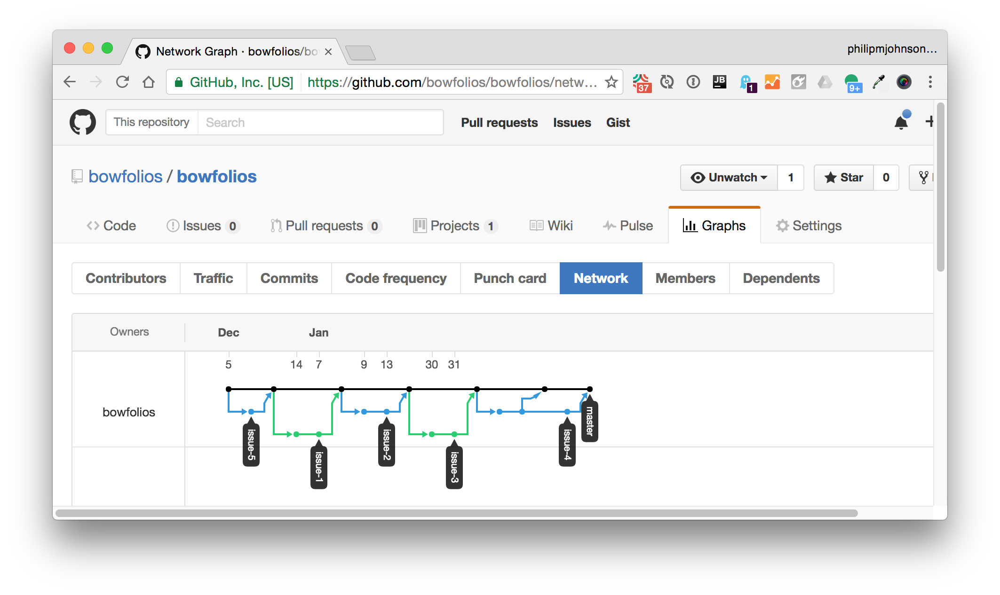

## Milestone 2: Data model development 

This milestone started on Jan 31, 2017 and ended on Feb 2, 2017.

The goal of Milestone 2 was to implement the data model: the underlying set of Mongo Collections and the operations upon them that would support the BowFolio application.  We implemented the data model as a set of Javascript classes. The BaseCollection class provides common fields and operations. The ProfileCollection and InterestCollection classes inherit from BaseCollection and provide the persistent data structures useful for BowFolios. 
 
Also in this milestone, we implemented a set of mocha tests for the data model classes. These tests make sure we can create, manipulate, and delete the data model documents successfully.  Here is a screenshot of the browser interface to the Mocha test driver:

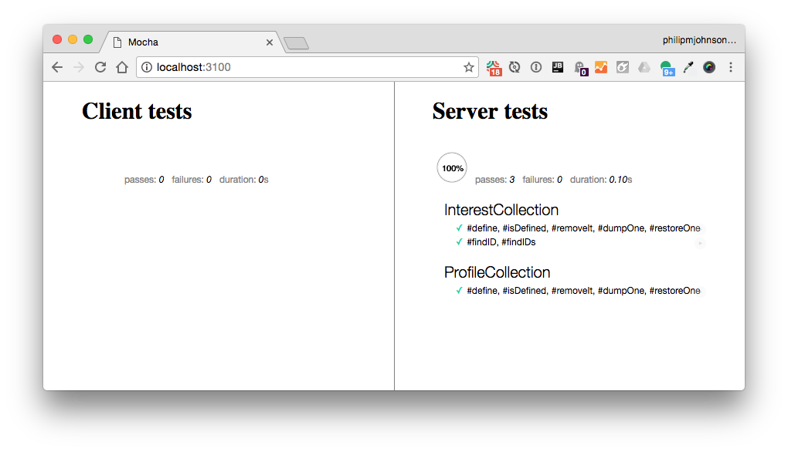

Milestone 2 was implemented as [BowFolio GitHub Milestone M2](https://github.com/bowfolios/bowfolios/milestone/2)::


Milestone 2 consisted of two issues, and progress was managed via the [BowFolio GitHub Project M2](https://github.com/bowfolios/bowfolios/projects/2):

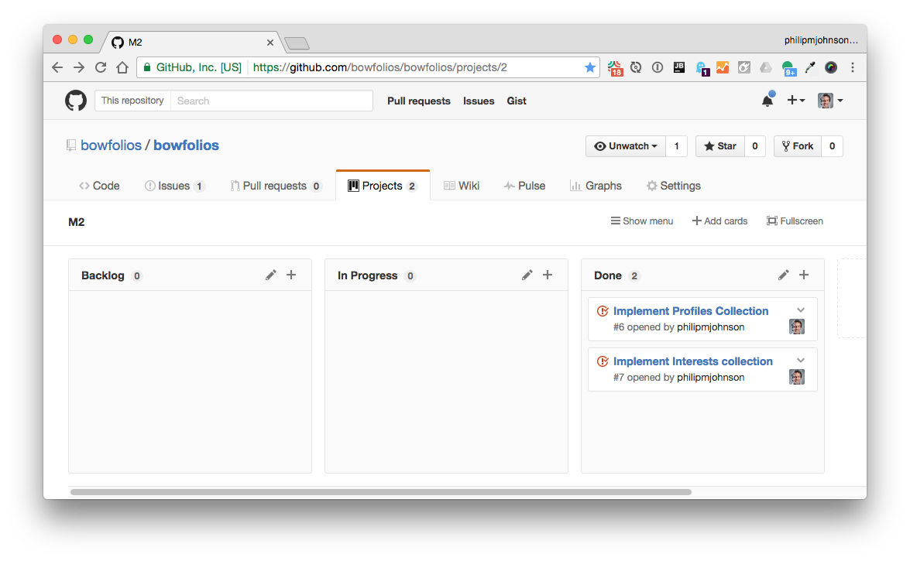

Each issue was implemented in its own branch, and merged into master when completed:

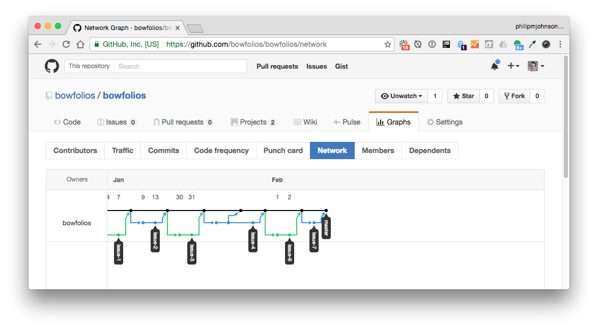

## Milestone 3: Connect UI to data model

This milestone started on Feb 2, 2017 and ended on Feb 10, 2017.

The goal of Milestone 3 was to connect the user interface to the underlying data model. This meant that we updated the templates for each page with calls to helper functions, and we created Javascript files for the templates with helper functions. We used the form control templates from [meteor-example-form](https://ics-software-engineering.github.io/meteor-example-form/) to simplify implementation of form processing.

Milestone 3 was implemented as [BowFolio GitHub Milestone M3](https://github.com/bowfolios/bowfolios/milestone/3)::

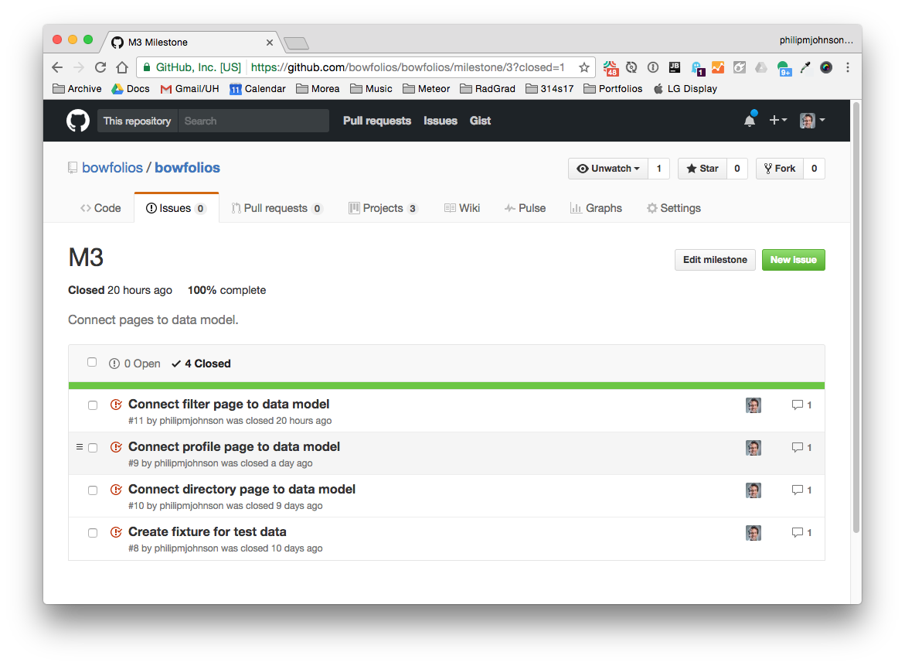


Milestone 3 consisted of four issues, and progress was managed via the [BowFolio GitHub Project M3](https://github.com/bowfolios/bowfolios/projects/3):

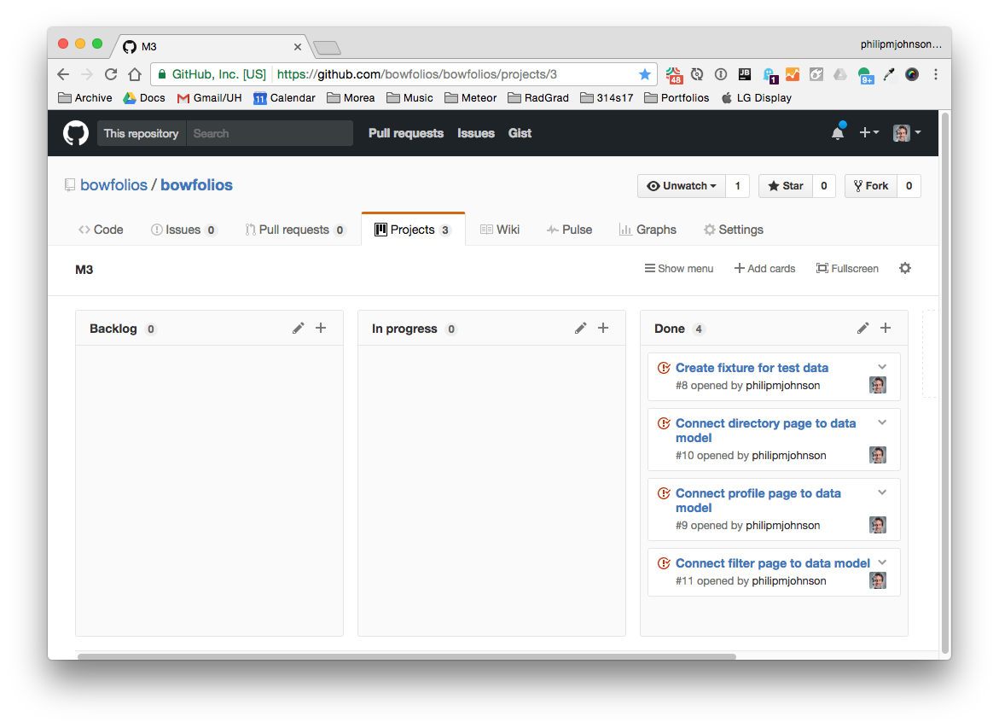

Each issue was implemented in its own branch, and merged into master when completed:


## Milestone 4: Authentication

This milestone started on Feb 10, 2017 and ended on Feb 14, 2017.

The goal of Milestone 4 was to set up authentication using the University of Hawaii test CAS system. We used the templates from [meteor-example-uh-cas](http://ics-software-engineering.github.io/meteor-example-uh-cas/) to guide the implementation. Although the example restricts logins to those in a list in the configuration file, BowFolios allows anyone with a UH account to access the system. 

Authentication also implies that users cannot access the profile or filter page associated with another user.

Milestone 4 was implemented as [BowFolio GitHub Milestone M4](https://github.com/bowfolios/bowfolios/milestone/4)::

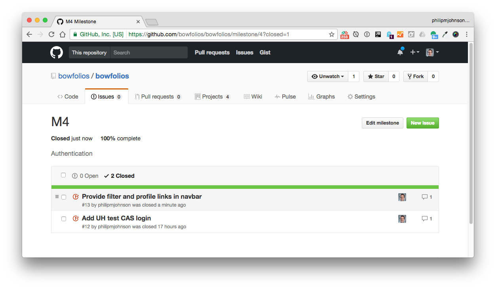


Milestone 4 consisted of two issues, and progress was managed via the [BowFolio GitHub Project M4](https://github.com/bowfolios/bowfolios/projects/4):

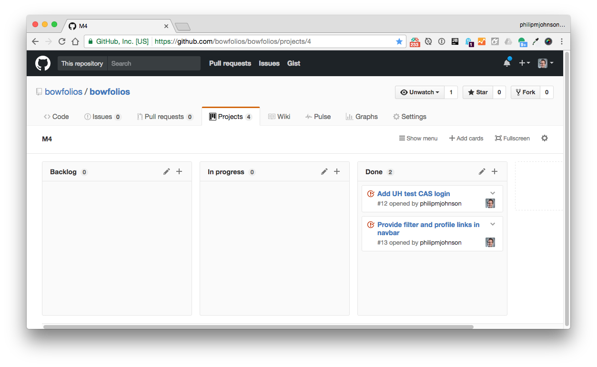

Each issue was implemented in its own branch, and merged into master when completed:

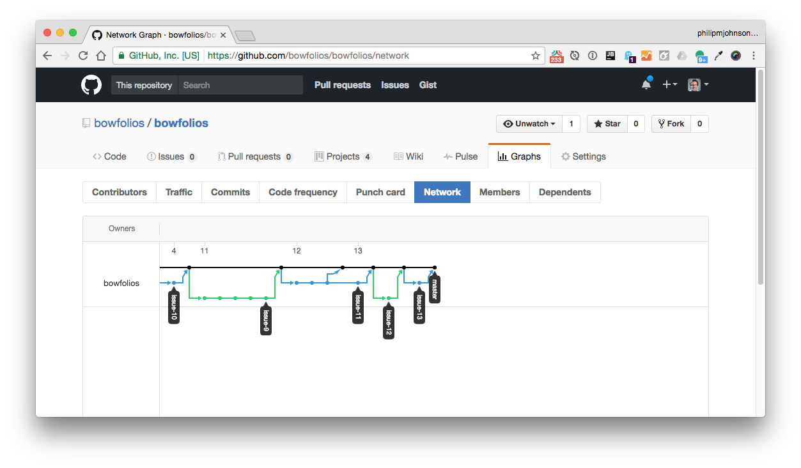

## Milestone 5: Administration

This milestone started on Feb 14, 2017 and is ongoing.

[BowFolio GitHub Milestone 5](https://github.com/bowfolios/bowfolios/milestone/5) involves the creation of an administrator role in the system. The administrator can manage the set of defined interests. (Currently, interests are defined in the database file loaded at system startup time.)

This milestone will also include the implementation of Meteor methods and removal of the insecure package. 

We will manage progress on this milestone using [BowFolio GitHub Project M5](https://github.com/bowfolios/bowfolios/projects/5).


